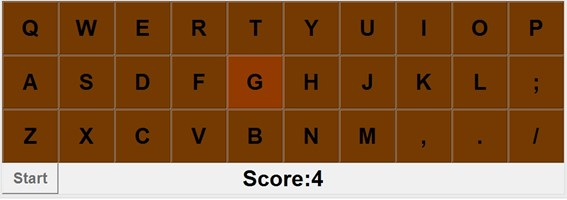
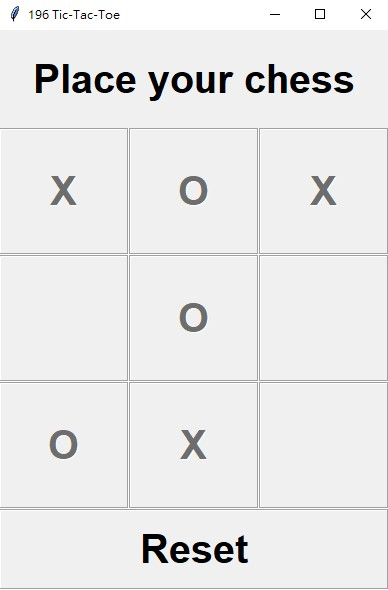

# 色塊遊戲([詳細操作演示](https://drive.google.com/file/d/1UkHrZxi-vXN8hQgVGjQtQa6dRRNTTEY-/view?usp=sharing))
這是一個有完整防呆功能的小遊戲  

# tic-tac-toe
與人工智慧玩井字遊戲，使用 minimax algorithm 搭配 alpha-beta pruning。  

# 英雄聯盟 5v5 訓練模式
League of Legends client 開啟後，執行 5v5.py 可建立 5v5 訓練模式

# 簡易選課系統
有檢查課堂時間是否衝突機制，選課完畢後輸出選課結果，詳見[簡易選課系統](https://drive.google.com/file/d/1Phw8q_tNvmk4RwxE4TlnysdbiyE0AsnD/view?usp=sharing)

# 簡易網購系統
選購完畢後列出購買清單及總價，詳見[簡易網購系統](https://drive.google.com/file/d/13izaC6GrckvCnnkUxJd1iGg4pbSA8tM3/view?usp=sharing)

# 網際網路協定
與網際網路協定相關的小程式
